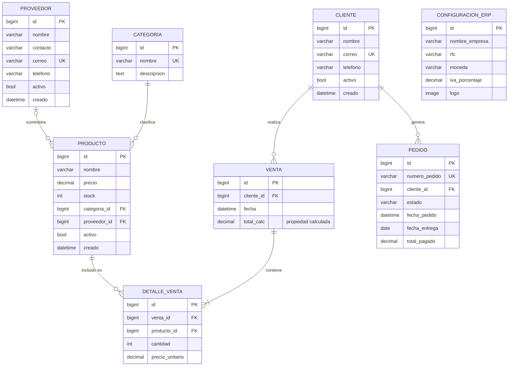

# Diagrama Entidad-Relación — ERP Django
## Espiral 2 · Aprobado por: MC. Román Fernando López González
## Fecha de aprobación: __09_/__OCT_/_2026____

## Cardinalidades

| Relación | Tipo | Descripción |
|---|---|---|
| Categoria → Producto | 1:N obligatorio | Un producto siempre tiene categoría |
| Proveedor → Producto | 1:N opcional | Un producto puede no tener proveedor |
| Cliente → Venta | 1:N | Una venta siempre tiene cliente |
| Cliente → Pedido | 1:N | Un pedido siempre tiene cliente |
| Venta → DetalleVenta | 1:N obligatorio | Una venta tiene al menos 1 línea |
| Producto → DetalleVenta | 1:N | Un producto puede aparecer en N ventas |

## Notas de diseño

- `Venta.total` es una **propiedad calculada**, no un campo de BD (decisión D-04)
- `DetalleVenta.precio_unitario` se almacena por integridad histórica (D-06)
- `ConfiguracionERP` es un **singleton** (siempre pk=1) (D-07)
- `Pedido` se implementa en la **Espiral 5 (W13-W15)**

## Firma de aprobación

| Rol | Nombre | Fecha | Observaciones |
|---|---|---|---|
| Desarrollador | [Nombre] | | |
| Asesor (PO) | MC. Román Fernando López González | | |